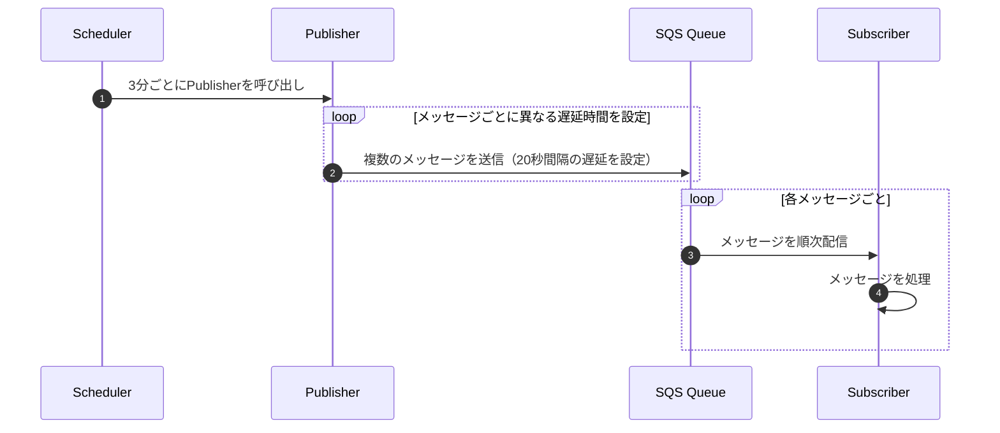

こんにちは、[sugar-cat](https://twitter.com/sugar235711)です。

アプリケーション開発では、短い間隔で定期的な処理を実行したい場面がよくあります。
多くのクラウドサービスでは、cron式やrate式を使用して定期実行を設定できますが、**1分未満の間隔**での実行が必要な場合は工夫が必要です。

[Amazon EventBridge](https://docs.aws.amazon.com/ja_jp/lambda/latest/dg/with-eventbridge-scheduler.html)などでは、最小単位が「1分」であり、1分未満の頻度で処理を実行することはできません。
アプリケーション層で秒単位のスケジューラを実装する方法もありますが、起動タイミングの管理やスケール時の挙動など、考慮すべき事項が増えてしまいます。できるだけ単純化し、メッセージの受信に応じて処理を行うだけにしたいです。

この記事では、こうした要件を簡単に実現するために、**SQSを使用して1分未満の定期実行を実現する方法**を紹介します。

## 方法

今回のアプローチでは、SQSキューの**遅延実行**機能を利用します。この例ではAWSのSQSを使用しますが、Google CloudやAzureでも同様の機能を利用できます（Google Cloud Pub/Subでは遅延実行が制御できないため、Cloud Tasksなどを使うと良いと思います）。

### 実行フロー

以下のようなフローで処理を実行します。

1. **EventBridgeなどのスケジューラでPublisherを呼び出す**
2. Publisherが複数のメッセージを、異なる遅延時間を設定してキューに送信
3. **Subscriber**がキュー内のメッセージを受信し、順次処理を実行

例えばですが、PublisherをEventSchedulerで3分ごとに呼び出し、SQSに20秒の遅延をつけて9回分のメッセージを送信しておくことで擬似的に20秒間隔でSubscriber側の処理を実行することができます。




:::message
この例では、通常のSQSキューを使用しますが、メッセージの重複配信を厳密に防ぎたい場合はFIFOキューを使うと良いと思います。
https://docs.aws.amazon.com/ja_jp/AWSSimpleQueueService/latest/SQSDeveloperGuide/sqs-fifo-queues.html
:::


今回はLocalStackを使用して検証を行います。Publisher及びSubscriberのLambda関数をそれぞれ作成し、ローカルでBupulisherを呼び出し、一定間隔の秒数でSubscriberが実行されることを確認します。

```go:publisher.go
package main

import (
	"context"
	"encoding/json"
	"fmt"
	"log"
	"time"

	"github.com/aws/aws-lambda-go/lambda"
	"github.com/aws/aws-sdk-go-v2/aws"
	"github.com/aws/aws-sdk-go-v2/config"
	"github.com/aws/aws-sdk-go-v2/credentials"
	"github.com/aws/aws-sdk-go-v2/service/sqs"
	"github.com/aws/aws-sdk-go-v2/service/sqs/types"
)

const queueURL = "http://sqs.us-east-1.localhost.localstack.cloud:4566/000000000000/test-queue"

type Message struct {
	Timestamp int64  `json:"timestamp"`
	Content   string `json:"content"`
}

func Handler(ctx context.Context) (string, error) {
	cfg, err := config.LoadDefaultConfig(context.TODO(),
		config.WithRegion("us-east-1"),
		config.WithCredentialsProvider(credentials.NewStaticCredentialsProvider("dummy", "dummy", "")),
		config.WithBaseEndpoint("http://sqs.us-east-1.localhost.localstack.cloud:4566"),
	)
	if err != nil {
		log.Fatalf("unable to load SDK config, %v", err)
	}

	svc := sqs.NewFromConfig(cfg)

	var entries []types.SendMessageBatchRequestEntry
	now := time.Now().Unix()

	// 1メッセージを20秒ごとの遅延付きでキューに投入
	for i := 1; i <= 9; i++ {
		delaySeconds := int32(i * 20)
		// 20秒ごとの遅延
		msg := Message{
			Timestamp: now,
			Content:   fmt.Sprintf("Triggering job %d", i),
		}
		msgBody, _ := json.Marshal(msg)

		entries = append(entries, types.SendMessageBatchRequestEntry{
			Id:           aws.String(fmt.Sprintf("msg_%d", i)),
			MessageBody:  aws.String(string(msgBody)),
			DelaySeconds: delaySeconds,
		})
	}

	// メッセージのバッチ送信
	_, err = svc.SendMessageBatch(context.TODO(), &sqs.SendMessageBatchInput{
		QueueUrl: aws.String(queueURL),
		Entries:  entries,
	})
	if err != nil {
		log.Printf("Error sending batch: %v", err)
		return "", err
	}
	return "Messages queued successfully", nil
}

func main() {
	lambda.Start(Handler)
}
```

```go:subscriber.go
package main

import (
	"context"
	"encoding/json"
	"log"
	"time"

	"github.com/aws/aws-lambda-go/events"
	"github.com/aws/aws-lambda-go/lambda"
	"github.com/aws/aws-sdk-go-v2/aws"
	"github.com/aws/aws-sdk-go-v2/config"
	"github.com/aws/aws-sdk-go-v2/credentials"
	"github.com/aws/aws-sdk-go-v2/service/sqs"
)

const queueURL = "http://sqs.us-east-1.localhost.localstack.cloud:4566/000000000000/test-queue"

type Message struct {
	Timestamp int64  `json:"timestamp"`
	Content   string `json:"content"`
}

func Handler(ctx context.Context, sqsEvent events.SQSEvent) {
	cfg, err := config.LoadDefaultConfig(context.TODO(),
		config.WithRegion("us-east-1"),
		config.WithCredentialsProvider(credentials.NewStaticCredentialsProvider("dummy", "dummy", "")),
		config.WithBaseEndpoint("http://sqs.us-east-1.localhost.localstack.cloud:4566"),
	)
	if err != nil {
		log.Fatalf("unable to load SDK config, %v", err)
	}

	svc := sqs.NewFromConfig(cfg)

	// 各メッセージを処理
	for _, record := range sqsEvent.Records {
		var msg Message
		err := json.Unmarshal([]byte(record.Body), &msg)
		if err != nil {
			log.Printf("Error parsing message: %v", err)
			continue
		}

		// メッセージ受信と処理時間の計測
		arrivalTime := time.Now().Unix()
		delay := arrivalTime - msg.Timestamp

		// メッセージの削除（ACK）
		_, err = svc.DeleteMessage(context.TODO(), &sqs.DeleteMessageInput{
			QueueUrl:      aws.String(queueURL),
			ReceiptHandle: aws.String(record.ReceiptHandle),
		})
		if err != nil {
			log.Printf("Failed to delete message: %v", err)
			continue
		}
	}
}

func main() {
	lambda.Start(Handler)
}
```

上記をビルドし、localstackを起動した状態でLambda関数とSQSキュー、トリガーを作成します。
```bash
# publiser
awslocal lambda create-function --function-name PublisherFunction \
    --runtime go1.x --handler publisher --zip-file fileb://publisher.zip \
    --role arn:aws:iam::000000000000:role/lambda-role

# subscriber
awslocal lambda create-function --function-name SubscriberFunction \
    --runtime go1.x --handler subscriber --zip-file fileb://subscriber.zip \
    --role arn:aws:iam::000000000000:role/lambda-role

# sqs
awslocal sqs create-queue --queue-name test-queue                

# event source mapping
awslocal lambda create-event-source-mapping --function-name SubscriberFunction \
    --batch-size 9 \
    --event-source-arn arn:aws:sqs:us-east-1:000000000000:test-queue
```


リソース作成後にpublisherを呼び出し、subscriber側の起動時間のログを確認します。

```bash
# invoke
awslocal lambda invoke --function-name PublisherFunction output.json

# log
awslocal logs get-log-events --log-group-name /aws/lambda/SubscriberFunction --log-stream-name 2024/11/02/\[\$LATEST\]b3d025f2eeac8c63595c6b6d61b692cb | \
jq -r '.events[] | select(.message | startswith("START")) | .timestamp' | \
while read timestamp; do date -r $((timestamp / 1000)) +"%Y-%m-%d %H:%M:%S"; done
```

実行した結果は下記です。20秒ごとにSubscriberでメッセージが処理されていることが確認できます。
```log
2024-11-02 19:24:38
2024-11-02 19:24:58
2024-11-02 19:25:18
2024-11-02 19:25:38
2024-11-02 19:25:58
2024-11-02 19:26:18
2024-11-02 19:26:38
2024-11-02 19:26:58
2024-11-02 19:27:18
```

実際の環境では分散実行のためタイムラグやLambdaの起動時間などが合わさり、正確な秒数での処理は難しいかもしれませんが、数秒程度のずれが許容できる場合には有用な方法だと思います。

## まとめ

SQSの遅延実行機能を利用することで、1分未満の定期実行を簡単に実現できることできます。

