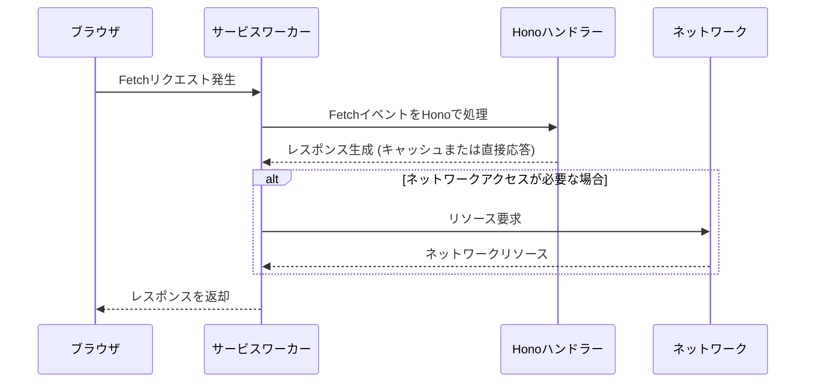

こんにちは、[sugar-cat](https://twitter.com/sugar235711)です。

この記事は[Hono Advent Calendar](https://qiita.com/advent-calendar/2024/hono) 2024の12日目の記事です。

## はじめに
Honoではv4.5系でService Workerのアダプターを使用することができるようになりました。
このアダプターを使用することで、リクエストのインターセプトや各種処理をHonoの書き味のまま実装することが可能になります。

## Service Workerについて

Service Workerは、ブラウザとネットワークの間でプロキシとして機能します。  
ブラウザのバックグラウンドで動作し、キャッシュやプッシュ通知などのタスクを処理するスクリプトとして利用されています。

https://developer.mozilla.org/ja/docs/Web/API/Service_Worker_API

ライフサイクルについては、以下の動画がわかりやすいです。  
https://www.youtube.com/watch?v=AIdQkNYsViM

このService Workerには、`fetch`イベントがあります。
https://developer.mozilla.org/ja/docs/Web/API/FetchEvent

この`fetch`イベントはメインスレッドがネットワークリクエストを行う際に、サービスワーカーのグローバルスコープで発生し`addEventListener("fetch", (event) => {});`のイベントハンドラーでメインスレッドのレスポンスを差し替えることができるものです。(要はリクエストをProxyできます)

そしてこのハンドラーに**Honoのアダプター**を噛ませることでService Workerの開発がしやすくなります。
https://hono.dev/docs/getting-started/service-worker

イベントはスクリプトを登録した`ServiceWorkerGlobalScope`に配信されます。  
以下に処理の流れを示します。

1. ブラウザが`ServiceWorkerGlobalScope`を生成します。
2. `fetch`イベントのコールバックを提供します。
3. サービスワーカーでこのコールバックをHonoのハンドラーとして実装されており、リクエストを処理します。



### 使い方

#### Service Workerの登録

Service Workerを登録するには、クライアント側で`ServiceWorkerContainer.register()`を使用します。

https://developer.mozilla.org/ja/docs/Web/API/ServiceWorkerContainer/register#updateviacache

```ts:client.ts
navigator.serviceWorker.register('/service-worker.js', {
  scope: '/sw',
  type: 'module',
  updateViaCache: 'none',
});
```

:::message
- `scope`:
  - サービスワーカーが制御するURL範囲を指定します。
  - デフォルトでは、サービスワーカースクリプトが配置されているディレクトリになります。
  - [サーバーで`Service-Worker-Allowed`ヘッダー](https://w3c.github.io/ServiceWorker/#service-worker-allowed)を設定することで、スコープを変更可能です。

- `type`:
  - `module`を指定するとES Modulesを使用可能になります。

- `updateViaCache`:
  - Service Workerがリクエストを処理する際に、キャッシュされたリソースを使用するかどうかを設定します。
:::

#### Service Worker内のスクリプトでHonoを利用する

次に、Service Workerの[FetchEvent](https://developer.mozilla.org/ja/docs/Web/API/FetchEvent)のハンドラーとしてHonoを利用する方法を紹介します。

```ts:service-worker.ts
// https://github.com/microsoft/TypeScript/issues/14877
declare const self: ServiceWorkerGlobalScope;

import { Hono } from 'hono';
import { handle } from 'hono/service-worker';

const app = new Hono().basePath('/sw'); // クライアント側のService Workerのスコープを指定
app.get('/', (c) => c.text('Hello World'));

self.addEventListener('fetch', handle(app));
```

`hono/service-worker`のアダプターが提供されており、Honoインスタンスをそのまま渡すだけで、インターセプトしたいfetchのパスを通常のAPIと同様に記述できます。  
ttps://github.com/honojs/hono/blob/47bb23c575a93d5fed4721935481a6a4cbf5cf1a/src/adapter/service-worker/handler.ts#L14-L34

このスクリプトをお好みのツールでトランスパイルし、公開されているディレクトリに配置することでService Workerが有効になります。

上記の例では、クライアント側から`fetch('/sw')`でリクエストが来た場合、仮に`/sw`というエンドポイントで定義されたAPIが存在しても、`Hello World`というテキストを返すようになります。

## Next.jsでService Workerを利用する(実践)

実際の開発では、様々なライブラリと組み合わせてService Workerを利用することが多いです。  
ここではNext.js (App Router) とHono、Service Workerを組み合わせて、OpenAIからストリームを受け取り表示する簡単なChatGPTライクなアプリを作成します。  
UIは適当にv0で作成しています。


コード全体は下記にあります。
https://github.com/sugar-cat7/example-hono-service-worker


まず、OpenAIのストリームを返すエンドポイントを作成します。  
今回は簡単のため、API Routesで作成します。  

https://hono.dev/docs/getting-started/vercel

また、OpenAIのストリームとHonoのStream Helperを組み合わせて利用するために、AI SDKを組み合わせて使用します。  
https://sdk.vercel.ai/docs/reference/ai-sdk-ui/use-chat

```ts:app/api/[[...route]]/route.ts
import { createOpenAI } from '@ai-sdk/openai';
import { streamText } from 'ai';
import { Hono } from 'hono';
import { stream } from 'hono/streaming';
import { handle } from 'hono/vercel';

export const runtime = 'edge';

const openai = createOpenAI({
  compatibility: 'strict',
  organization: "xxx",
  project: "xxx",
  apiKey: "xxx",
  baseURL: "xxx",
});

const app = new Hono().basePath('/api');

app.post('/chat', async (c) => { // /api/chatでストリームを返す
  const r = await c.req.json();
  return stream(c, async (stream) => {
    const result = await streamText({
      model: openai('gpt-4o-mini'),
      messages: r.messages,
    });
    await stream.pipe(result.toDataStream());
  });
});

export const GET = handle(app);
export const POST = handle(app);
```

次に、クライアント側の定義です。  
SSEを扱いやすくするために、Vercelが提供している`AI SDK`の`useChat`フックを利用します。

```tsx:app/page.tsx
'use client';
import { useChat } from 'ai/react';
// 略

export default function Page() {
  const { messages, input, handleInputChange, handleSubmit } = useChat({
    api: '/sw/chat', // Service Workerで定義したエンドポイントを叩く
  });

  useEffect(() => {
    if ("serviceWorker" in navigator) {
      navigator.serviceWorker
        .register("/sw.js", { scope: "/", type: "module" }) // Service Workerを登録
        .then(
          function (_registration) {
            console.log("Service Workerの登録に成功しました");
          },
          function (_error) {
            console.log("Service Workerの登録に失敗しました");
          }
        );
    }
  }, []);

 // 省略
}
```

次に、Service Workerの定義です。  
トランスパイル前のコードなのでTypeScriptで記述しています。  
クライアント側で使用している`useChat`では内部的にPOSTリクエストを送信しており、Service Workerを利用してこのリクエストをインターセプトし、OpenAIのストリームを受け取ります。  
どのようなリクエストであってもfetchを通るものであればインターセプト可能であり、ライブラリ内で抽象化されたAPIリクエストでも問題ありません。

`ServiceWorkerGlobalScope`の型補完を有効にするために、`tsconfig`の`compilerOptions`に`"lib": ["webworker"]`を追加しています。  
`/sw/chat`にリクエストが来た場合に、`/api/chat`にリクエストをプロキシし、そのレスポンスをSSEで返すようにします。

```ts:lib/sw.ts
import { Hono } from "hono";
import { handle } from "hono/service-worker";
import { streamText } from "hono/streaming";

// https://github.com/microsoft/TypeScript/issues/14877
declare const self: ServiceWorkerGlobalScope;

const app = new Hono().basePath("/sw");

app.post("/chat", async (c) => {  // /sw/chatにリクエストが来た場合にインターセプト
  const { messages } = await c.req.json();
  return streamText(c, async (stream) => {
    const response = await fetch('/api/chat', { // API Routesのchatエンドポイントにリクエストをプロキシ
      method: 'POST',
      headers: {
        'Content-Type': 'application/json',
      },
      body: JSON.stringify({ messages }),
    });

    if (!response.body) {
      await stream.write('data: [ERROR] レスポンスボディが存在しません\n\n');
      return;
    }

    const reader = response.body.getReader();
    const decoder = new TextDecoder();

    try {
      while (true) {
        const { done, value } = await reader.read();
        if (done) break;

        const text = decoder.decode(value, { stream: true });
        await stream.write(text);
      }
    } finally {
      await stream.write('data: [DONE]\n\n');
      reader.releaseLock();
    }
  });
});

self.addEventListener("fetch", handle(app));
```

上記を動作させると、Service Workerを利用してAPIへリクエストが飛んでいることが確認できます。(歯車アイコンがService Worker)  


この実装では単純にリクエストを受け流していますが、応用すればクライアント側での入力値のサニタイズや、リクエストのキャッシュなど様々な処理をメインスレッドから分離してService Workerで行うことが可能です。

### まとめ
Honoを組み合わせてService Workerを利用することで、FetchEventの扱いが少し楽になります。