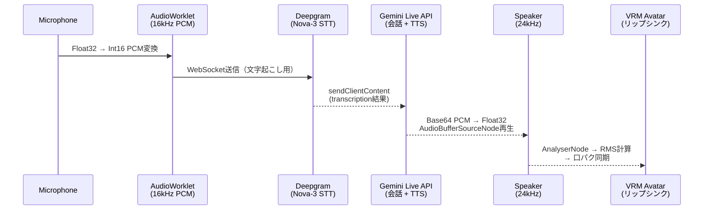
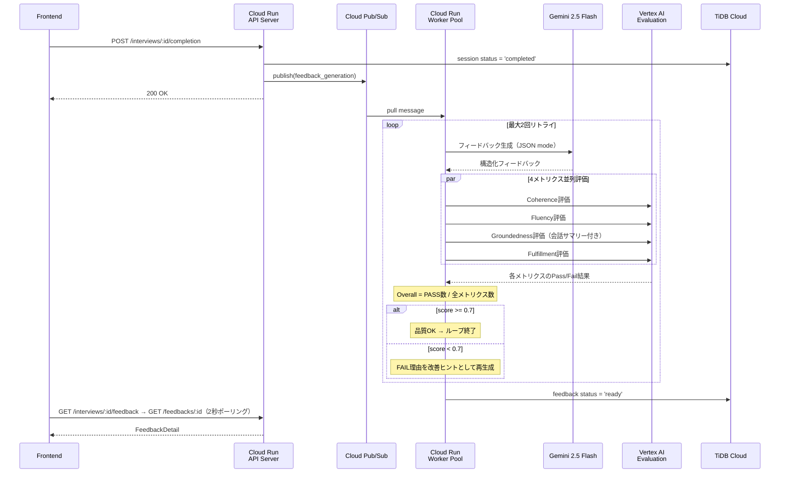

この記事は[Google Cloud Japan AI Hackathon vol.4](https://zenn.dev/hackathons/google-cloud-japan-ai-hackathon-vol4)への応募記事です。

こんにちは、[@sugar235711](https://twitter.com/sugar235711)です。

BA-SUUは、AIアバターと音声で面接練習ができるWebアプリです。練習相手がいない、お金がない、でも面接は怖い──そんな就活生が「場数」を踏めるように作りました。

@[youtube](gCh0PfUTDDM)

:::message
**お知らせ:** BA-SUUの公式アカウントを作成しました。本公開に向けてβテスターを募集中です。ご興味を持っていただいた方は、サイト内のGoogle Formからお申し込みいただけます。
https://x.com/interview_49603
:::

---

## 日本の就活生にとって面接は最大の壁

就活準備で最も不安な項目は「面接対策」で36.2%。筆記試験対策を上回り、就活生にとって面接は最大のストレス源です[^1]。転職希望者では70〜74%が「想定外の質問」に強い不安を感じています[^2]。

2026年卒の就活を表す漢字1位は「苦」（4年ぶり）[^3]。面接に「自信がある」と答えた学生は2割に満たないという調査もあります[^4]。面接は就活全体を通じて、最も心理的負荷が高いプロセスであり続けています。

### 面接受験は平均約10社──練習量が圧倒的に足りない

2025年卒の7月時点では、採用面接を受けた社数平均累計は10.4社でした[^5]。26年卒のエントリー数は28.5社（過去5年最多）に達していますが、面接まで進む企業はその一部にすぎません[^6]。

意図的練習（Deliberate Practice）の研究[^7]では、スキル習得には「フィードバック付きの反復練習」が不可欠とされています。ただ繰り返すだけではなく、何がよかったか・何を改善すべきかを知り、次に活かすサイクルが重要です。

しかし実際の面接は「本番」であり、落ちたら理由もわからないまま次へ進むしかありません。約10社の面接では、フィードバック付きの練習サイクルが回る余地はほとんどありません。

### 既存の手段では十分な練習ができない

| 練習手段 | 費用の目安 | 主な制約 |
|---------|----------|---------|
| 大学キャリアセンター | 無料 | 利用率50.8%、利用頻度は月1回程度が最多（22.7%）[^8] |
| スキルマーケット | 有料（単発課金） | 単発が主、改善サイクルが回らない[^9] |
| 有料就活塾・コーチング | 高額になりやすい | 就活費用の平均は8万2,277円[^10]。継続利用のハードルが高い |
| 友人・知人との練習 | 無料 | 客観的なフィードバックがない、気を遣う[^11] |

キャリアセンターは「就活対策（面接・ES等）」を今後利用したい学生が63.3%にのぼる一方、利用しない学生の35.9%は「活用方法がわからない」と回答しています[^8]。ニーズはあるのに、月1回程度のペースでは実戦的な練習量に到底足りません。

### 就活生はAIに頼り始めている──でもAI面接は怖い

2026年卒の就活生の82.7%がAIを利用した経験があり、就活でのAI利用率は66.6%に達しています（[マイナビ](https://career-research.mynavi.jp/wp-content/uploads/2025/05/s-syuusyoku-26-04-02.pdf)）。面接対策でのAI利用は36.6%で、前年（17.8%）から18.8ポイント増と急伸しました（[マイナビ](https://career-research.mynavi.jp/wp-content/uploads/2025/05/s-syuusyoku-26-04-02.pdf)）。

就活生は面接対策の手段としてAIに可能性を感じています。しかし同時に、企業の選考にAIが使われること（いわゆる「AI面接」）には強い抵抗感があります。77.5%の学生がAI面接で「受験意欲が下がる」と回答し、その理由は「人に評価してほしい」（41.2%）、「AIの精度が信用できない」（34.0%）、「感情や空気をくみ取ってもらえない」（32.9%）です（[マイナビ](https://career-research.mynavi.jp/wp-content/uploads/2025/05/s-syuusyoku-26-04-02.pdf)）。

BA-SUUはこの矛盾に応えるプロダクトです。AIを「練習相手」として活用しつつ、「審判」にはしない。5軸の評価基準を開示し、合否判定は出さず、改善アクションだけを返す設計にしています。

## BA-SUUの体験フロー

### セットアップ

ユーザーは以下を選択して面接を開始します。

- 練習モード: 通常面接（10分）/ 一問一答深掘り（5分）
- AI面接官: 4名のプリセットから選択（性格・声・面接スタイルが異なる）


### 面接実施

- リアルタイム音声対話: Gemini Live APIによる双方向WebSocket通信。日本語で自然な対話が可能
- VRM 3Dアバター: AI面接官の音声に同期したリップシンクで、対人感覚を再現


### フィードバック

面接終了後、非同期でAIがフィードバックを生成し、以下を表示します。

- 5軸レーダーチャート: 構造力 / 一貫性 / 深掘り耐性 / 具体性 / 明瞭さ（各0〜100）
- 改善アクション: 次の練習で意識すべき具体的な行動
- 発話メトリクス: 沈黙回数 / 平均応答時間 / 言い直し回数 / 総発話時間
- 詰まりポイント: 会話ログからAIが1〜3件を抽出してタイムライン表示（補助指標として5秒以上の沈黙回数・言い直し回数を提示）
- 次の練習提案: 弱点に基づく最適な次のテーマを自動推薦


---

## アプリケーション実装

### Gemini Live API × Deepgram のデュアルパイプライン

BA-SUUの音声対話は、Gemini Live API（応答生成 + TTS）とDeepgram Nova-3（STT）を併用するデュアルパイプラインで構成しています。

最初はGemini Live APIだけで完結させようとしました。短い発話なら問題ないのですが、長い日本語の発話で話していない内容が文字起こしされてしまい、フィードバックの品質が根本から崩れました。
https://zenn.dev/king/scraps/e2ffbf09393486

試行錯誤の結果、STTはDeepgram Nova-3に完全分離し、Live APIは応答生成+TTS専用という構成に落ち着きました。

- AudioWorkletでマイク音声を16kHz Int16 PCMに変換し、Deepgram WebSocketに送信
- VADはDeepgram側に任せ、応答生成はLive APIに委譲。ストリームでDeepgram → Live APIへ文字起こし結果を渡す
- Ephemeral Tokenを使い、各クライアントが直接WebSocket接続する構成にしているため、中継サーバーを持たない




```ts
  // === 1. AudioWorklet: マイク音声を16kHz Int16 PCMに変換 ===                                               
  class PcmRecorderWorklet extends AudioWorkletProcessor {
    buffer = new Int16Array(2048);                                                                            
    writeIndex = 0;                                                                                         

    process(inputs) {
      const channelData = inputs[0]?.[0];
      if (!channelData) return true;

      for (let i = 0; i < channelData.length; i++) {
        this.buffer[this.writeIndex++] = Math.max(-1, Math.min(1, channelData[i])) * 0x7FFF;
        if (this.writeIndex >= this.buffer.length) {
          this.port.postMessage({ type: "chunk", buffer: this.buffer.slice(0, this.writeIndex).buffer });
          this.writeIndex = 0;
        }
      }
      return true;
    }
  }

  // === 2. マイク → AudioWorklet → Deepgram WebSocket ===
  const audioContext = new AudioContext({ sampleRate: 16000 });
  const source = audioContext.createMediaStreamSource(micStream);
  await audioContext.audioWorklet.addModule(workletUrl);
  const worklet = new AudioWorkletNode(audioContext, "pcm-recorder-worklet");
  source.connect(worklet);

  worklet.port.onmessage = (e) => {
    deepgramConnection.send(e.data.buffer);
  };

  // === 3. エコーキャンセル: 出力AnalyserNodeのRMSで判定 ===
  const outputAnalyser = audioContext.createAnalyser();
  gainNode.connect(outputAnalyser);
  outputAnalyser.connect(audioContext.destination);

  function checkAISpeaking() {
    const data = new Float32Array(outputAnalyser.fftSize);
    outputAnalyser.getFloatTimeDomainData(data);
    const rms = Math.sqrt(data.reduce((sum, v) => sum + v * v, 0) / data.length);
    return rms >= 0.01;
  }

  // === 4. Deepgram確定テキスト → エコー判定 → Gemini Live API ===
  function handleDeepgramTranscript(result) {
    if (!result.isFinal) return;
    // 確定テキストをLive APIに先行送信
    sendClientContent({
      turns: { role: "user", parts: [{ text: result.text }] },
      turnComplete: false,
    });

    // speechFinal（発話終了）でターン完了を通知
    if (result.speechFinal) {
      sendClientContent({
        turns: { role: "user", parts: [{ text: result.text }] },
        turnComplete: true,
      });
    }
  }

  // === 5. Gemini Live APIからの音声応答を再生 ===
  function enqueueAudioChunk(base64Data) {
    const bytes = atob(base64Data);
    const raw = new Uint8Array(bytes.length);
    for (let i = 0; i < bytes.length; i++) raw[i] = bytes.charCodeAt(i);

    // Int16 → Float32 変換
    const int16 = new Int16Array(raw.buffer);
    const float32 = new Float32Array(int16.length);
    for (let i = 0; i < int16.length; i++) float32[i] = int16[i] / 0x7FFF;

    const buffer = outputContext.createBuffer(1, float32.length, 24000);
    buffer.copyToChannel(float32, 0);
    const source = outputContext.createBufferSource();
    source.buffer = buffer;
    source.connect(gainNode); // → AnalyserNode → スピーカー
    source.start(nextStartTime);
    nextStartTime += buffer.duration;
  }

  ```


- エコーキャンセル

リアルタイム音声対話で特に厄介だったのはエコーループです。スピーカーからのAI音声がマイクに回り込み、Deepgramが誤認識し、turnCompleteが送信され、Geminiが自身の発話を中断する連鎖が発生します。対策として、出力経路のAnalyserNodeからリアルタイムにRMSを計算し、閾値を超えている間はDeepgramの認識結果を破棄することで、エコー由来のturnComplete送信を防いでいます。音声ストリーム自体は止めず、アプリケーション層のテキストレベルのフィルタリングで制御しています。


### Vertex AI Evaluation Serviceによるマルチメトリクス評価パイプライン

フィードバック品質の担保には、[G-Eval](https://arxiv.org/abs/2303.16634)で提案された、ルーブリックに基づくLLM-as-a-Judgeの考え方を取り入れています。

参考文献

https://zenn.dev/ubie_dev/articles/llm-as-a-judge-rubric-evaluation
https://arxiv.org/abs/2505.08775

**4メトリクスの並列評価**

Vertex AI Evaluation Serviceの`EvaluationServiceClient`を使い、生成されたフィードバックを4つのメトリクスで並列評価します。

| メトリクス | 日本語名 | 評価対象 | Pass閾値 |
|-----------|---------|---------|---------|
| Coherence | 一貫性 | フィードバックの論理的整合性 | 3/5 |
| Fluency | 流暢さ | 日本語の自然さ・読みやすさ | 3/5 |
| Groundedness | 根拠性 | 会話内容に基づいているか | 1/5 |
| Fulfillment | 指示達成度 | プロンプト指示への適合性 | 3/5 |

本実装では、Vertex AI Evaluation Serviceのルーブリックベース評価を使い、各メトリクスのPass/Failを判定しています。

https://cloud.google.com/vertex-ai/generative-ai/docs/models/evaluation-overview

```ts
const RUBRIC_METRICS = [
  { name: "coherence",    passThreshold: 3 },
  { name: "fluency",      passThreshold: 3 },
  { name: "groundedness",  passThreshold: 1 },
  { name: "fulfillment",  passThreshold: 3 },
];

// 4メトリクスを並列評価
const results = await Promise.all(
  RUBRIC_METRICS.map((metric) => evaluateMetric(metric, input)),
);
const passedCount = results.filter((r) => r.val?.passed).length;
const overallScore = passedCount / RUBRIC_METRICS.length; // 3/4以上（実値0.75以上）で合格
```


```ts
const QUALITY_THRESHOLD = 0.7;
const MAX_RETRY_COUNT = 2;

for (let attempt = 0; attempt <= MAX_RETRY_COUNT; attempt++) {
  const feedback = await generateOnce(input);
  const evalResult = await VertexFeedbackEvaluator.evaluate({
    conversationSummary: Turn.toSummaryText(turns),
    feedbackContent: FeedbackItem.toMarkdown(feedback),
  });
  if (evalResult.score >= QUALITY_THRESHOLD) return Ok({ feedback, status: "success" });
  // FAILしたメトリクス名を改善ヒントとして次回生成に渡す
}
return Ok({ feedback: bestResult, status: "best_effort" });
```

**文字起こしの精度向上**

フィードバック生成の前段階として、Deepgramの文字起こし結果をコンテキストアウェアに校正しています。面接テーマ（例: ガクチカ）や候補者情報を文脈として提供し、同音異義語や専門用語の誤認識を修正してからフィードバック生成に渡します。

ASR出力の校正では、下記論文のCoC（Chain-of-Correction）の考え方を参考にしています。文脈情報を与えつつ、セグメントごとにGemini 2.5 Flash（thinking budget = 0）で校正しています。
https://arxiv.org/pdf/2504.01519

### VRM 3Dアバター

面接官はVRM1.0形式の3Dアバターで、AI音声に同期したリップシンクで対面感覚を再現しています。アバターモデルは`VRoid Studio`で作成しています。

https://vroid.com/studio


Webレンダリングには`@pixiv/three-vrm`の`WebGLRenderer`を利用しています。
https://github.com/pixiv/three-vrm

- リップシンク

ストリーミング音声チャンクから毎フレームRMSを計算し、ノイズフロア除去・ゲイン増幅・指数移動平均スムージングを経て、VRMブレンドシェイプを駆動しています。


```ts
  function updateMouth(vrm) {
    const data = new Float32Array(analyser.fftSize);
    analyser.getFloatTimeDomainData(data);

    // RMS計算
    let sum = 0;
    for (let i = 0; i < data.length; i++) sum += data[i] * data[i];
    const rms = Math.sqrt(sum / data.length);

    // ノイズフロア除去 + 正規化
    const normalized = rms <= MOUTH_NOISE_FLOOR
      ? 0
      : (rms - MOUTH_NOISE_FLOOR) / (1 - MOUTH_NOISE_FLOOR);

    // ゲイン増幅
    const target = Math.min(1, normalized * MOUTH_OPEN_GAIN);

    // 指数移動平均スムージング
    const next = currentValue + (target - currentValue) * MOUTH_OPEN_SMOOTHING;
    currentValue = next;

    // VRMブレンドシェイプに適用
    vrm.expressionManager.setValue("aa", next);
  }
```

VRM規格には母音ごとの口形状（Aa/Ee/Oh等）が定義されていますが、現状はRMS 1値でAaのみを駆動するシンプルな方式です。より自然なリップシンクには、音声から母音を推定して各プリセットを個別に駆動する必要があり、今後の課題です。この領域も、今後のAI活用余地が大きいと考えています。


## インフラ構成

システムは主にCloudflare（Webフロントエンド）、Google Cloud Platform（バックエンド/AI）、外部サービス（STT/DB/Email）の構成です。

- 現状、WebSocketはクライアントから直接接続する方式のため、バックエンドはCloud Run APIとWorker Pool中心のサーバーレス構成です。
- DBにはTiDB Cloudを採用しています。TiDB ServerlessはGoogle CloudネイティブVPC上ではなくAWS側で提供されるため、Cloud NATの固定IP制御でTiDB Cloudへ接続しています。システムの構成上トラフィック規模は地位ないので、転送料は許容範囲です。
- メール送信はPoC段階のためResendを利用しています。1ドメインの送信者認証が可能で、月3,000通までは無料枠で運用できます。本運用でSLAを定める段階で、必要に応じてSendGridやSESへ移行予定です。


### Cloud Run Worker Pool × Cloudflare Tunnel による接続

BA-SUUのAPIサーバーへのアクセスはすべてCloudflare Tunnel経由で行っています。
接続フロー:

```
User → Cloudflare Edge（SSL終端 / DDoS / WAF / CDN）
  → Cloudflare Tunnel（暗号化、HTTP/2永続接続）
  → cloudflared（Cloud Run Worker Pool、VPC内、アウトバウンドのみ）
  → Private Google Access
  → Private DNS Zone（*.a.run.app → 199.36.153.8/30）
  → Cloud Run API（INTERNAL_ONLY ingress）
```

cloudflaredはCloudflareとの長時間HTTP/2またはUDP接続を維持する必要があります。Cloud Run Serviceはリクエスト駆動でリクエストタイムアウトなどの制約があるため、Tunnelコネクタの常時接続用途には不向きです。Worker Poolはリクエスト非依存ワークロードを載せられ、manual instance countで接続維持に必要な常駐数を制御できるため、Tunnelコネクタとして適しています。

参考
https://developers.cyberagent.co.jp/blog/archives/61112/


## 今後の展望

### プロダクト拡張
- 匿名模擬面接マッチング: 求職者同士のP2P練習。AIフィードバックと人間からの印象を両方得られる
- グループディスカッション（GD）練習: 複数AIアバターとのGDシミュレーション
- 業界・企業別シナリオ: IT / コンサル / メーカー等、業界特性に応じた質問傾向を再現

### 技術進化
- マルチモーダルフィードバック: 映像分析による姿勢・視線・表情の評価
- 適応的難易度調整: 過去スコアに基づくパーソナライズされた面接難度
- リアルタイムコーチングオーバーレイ: 練習中に改善ヒントを画面表示

BA-SUUのような非審判的な練習環境は、面接に苦手意識を持つすべての人に届けたいと考えています。

