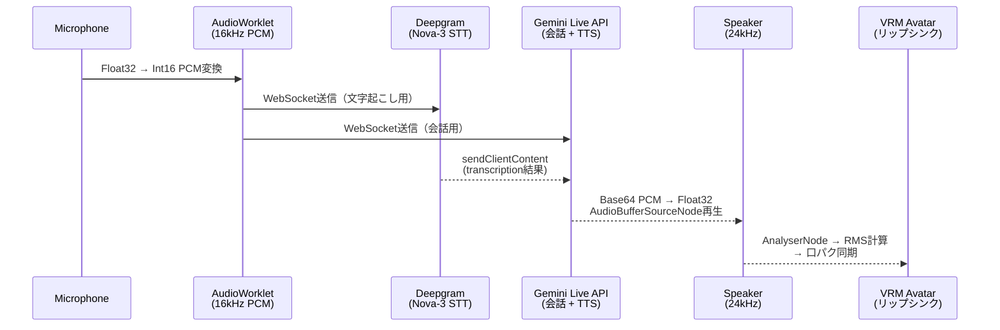
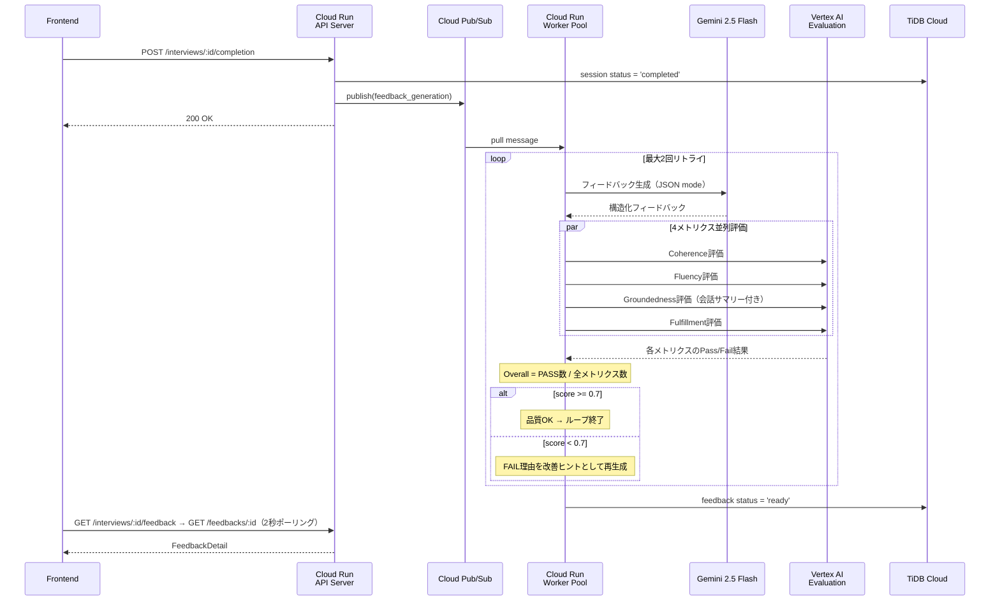

この記事は[Google Cloud Japan AI Hackathon vol.4](https://zenn.dev/hackathons/google-cloud-japan-ai-hackathon-vol4)への応募記事です。

こんにちは、[@sugar235711](https://twitter.com/sugar235711)です。


BA-SUU（就活・場数）は、AIアバターと音声で面接練習ができるWebアプリです。練習相手がいない、お金もない、でも面接は怖い──そんな就活生が「場数」を踏めるように作りました。

@[youtube](2O-2gehuj00)


---

## 1. 面接は「場数」がすべて、なのに場数を踏めない

### 日本の就活生にとって面接は最大の壁

就活準備で最も不安な項目は「面接対策」で36.2%。筆記試験対策を上回り、就活生にとって面接は最大のストレス源です[^1]。転職希望者の70〜74%が「想定外の質問」に強い不安を感じています[^3]。

2026年卒の就活を表す漢字1位は「苦」（4年ぶり）[^4]。面接に「自信がある」と答えた学生は2割に満たないという調査もあります[^5]。面接は就活全体を通じて、最も心理的負荷が高いプロセスであり続けています。

### 面接受験は平均約10社──練習量が圧倒的に足りない

2025年卒の7月時点では、採用面接を受けた社数平均累計は10.4社でした[^6]。26年卒のエントリー数は28.5社（過去5年最多）に達していますが、面接まで進む企業はその一部にすぎません[^7]。

意図的練習（Deliberate Practice）の研究[^8]では、スキル習得には「フィードバック付きの反復練習」が不可欠とされています。ただ繰り返すだけではなく、何がよかったか・何を改善すべきかを知り、次に活かすサイクルが重要です。

しかし実際の面接は「本番」であり、落ちたら理由もわからないまま次へ進むしかありません。約10社の面接では、フィードバック付きの練習サイクルが回る余地はほとんどありません。

### 既存の手段では十分な練習ができない

| 練習手段 | 費用の目安 | 主な制約 |
|---------|----------|---------|
| 大学キャリアセンター | 無料 | 利用率50.8%、利用頻度は月1回程度が最多（22.7%）[^9] |
| スキルマーケット | 有料（単発課金） | 単発が主、改善サイクルが回らない[^10] |
| 有料就活塾・コーチング | 高額になりやすい | 就活費用の平均は8万2,277円[^11]。継続利用のハードルが高い |
| 友人・知人との練習 | 無料 | 客観的なフィードバックがない、気を遣う[^12] |

キャリアセンターは「就活対策（面接・ES等）」を今後利用したい学生が63.3%にのぼる一方、利用しない学生の35.9%は「活用方法がわからない」と回答しています[^9]。ニーズはあるのに、月1回程度のペースでは実戦的な練習量に到底足りません。

### 就活生はAIに頼り始めている──でもAI面接は怖い

2026年卒の就活生の82.7%がAIを利用した経験があり、就活でのAI利用率は66.6%に達しています[^13]。面接対策でのAI利用は36.6%で、前年（17.8%）から18.8ポイント増と急伸しました[^13]。

就活生は面接対策の手段としてAIに可能性を感じています。しかし同時に、企業の選考にAIが使われること（いわゆる「AI面接」）には強い抵抗感があります。77.5%の学生がAI面接で「受験意欲が下がる」と回答し、その理由は「人に評価してほしい」（41.2%）、「AIの精度が信用できない」（34.0%）、「感情や空気をくみ取ってもらえない」（32.9%）です[^13]。

BA-SUUはこの矛盾に応えるプロダクトです。AIを「練習相手」として活用しつつ、「審判」にはしない。5軸の評価基準を開示し、合否判定は出さず、改善アクションだけを返す設計にしています。

### そもそも「人に見せる」こと自体がハードル

面接練習でも、「人に見られて評価されること」自体が心理的ハードルになります。

自信がない人ほど、最初に否定されると「もう練習したくない」となりやすい。練習が必要な人ほど練習から遠ざかるという構造的な問題があります。

---

## 2. なぜAIアバターなのか

BA-SUUがAIアバターで面接練習を提供する理由を、既存手段との比較で整理します。

| 観点 | 既存の限界 | BA-SUUのアプローチ |
|------|----------|-------------|
| 実戦的 | 最大でも数回の模擬面接 | 24時間365日、何度でも反復練習を時間・場所・コストの制約なく提供 |
| 心理的 | 練習相手への「評価される恐怖」 | 非審判的AIアバターが心理的安全性を担保。アバターフィードバックで不安が有意に軽減[^15] |
| 教育的 | 単発のアドバイス、質のバラツキ | 5軸スコア + 最大2改善アクションの一貫した成長サイクル |

十分な量の練習を全求職者に届けるには、人間のコーチでは物理的に無理です。AIなら同時に何人でも対話できます。

心理面でも大きいです。AIは疲れないし、呆れないし、感情で拒絶しません。アバターを介したフィードバックで2回目の試行時に不安が有意に軽減し、初期不安が高い人ほど「弱気な言葉」の使用が減少したという研究があります[^15]。

フィードバックの品質も安定させたかった。対人サービスは担当者によって品質がバラつきますが、BA-SUUではVertex AI Evaluation Serviceによる品質ゲートを通すことで、一定水準以上を担保しています。

そしてコスト。API課金ベースでは、1回あたりを低コストに抑えられる見込みです。

### コーチであって審判ではない

フィードバック設計で意識したのは、ユーザーを「判定」しないことです。

- 合否判定は出さない。スコアはレーダーチャートの参考値に留めて、ランク付けや合否予測はしません
- 改善アクションは最大2件まで。大量の指摘は「もうやりたくない」につながるので、小さな成功体験を積み重ねる方向に
- 弱点に基づく次の練習テーマを自動提案して、練習ループが途切れないようにしています

---

## 3. BA-SUUの体験フロー

### 3.1 セットアップ

ユーザーは以下を選択して面接を開始します。

- 練習モード: 通常面接（デフォルト10分、5〜60分）/ 一問一答深掘り（デフォルト5分、3〜10分）
- AI面接官: 4名のプリセットから選択（性格・声・面接スタイルが異なる）
  - 例: 田中一郎（標準・HR風）、佐藤厳（厳格・役員風）、山田優子（フレンドリー・チームリーダー風）、伊藤雅美（冷静・公平評価型）
- テーマ: 自己PR / ガクチカ / 志望動機 / 強み弱み / 失敗経験 / キャリアビジョン / カスタム

### 3.2 面接実施

- リアルタイム音声対話: Gemini Live APIによる双方向WebSocket通信。日本語で自然な対話が可能
- VRM 3Dアバター: AI面接官の音声に同期したリップシンクで、対人感覚を再現
- 沈黙検知: `silenceProgress`が100%（`SILENCE_TIMEOUT_MS = 10,000ms`）に達すると、AIが文脈に応じたフォローアップを実施
- フェーズ管理: 挨拶 → 質問 → 逆質問 → 締めを時間配分に基づき自動制御
- 適応的調整: 回答が短すぎる場合は深掘り、緊張が見られる場合はリラックス促進など、リアルタイムでAIの振る舞いを調整

### 3.3 フィードバック

面接終了後、非同期でAIがフィードバックを生成し、以下を表示します。

- 5軸レーダーチャート: 構造力 / 一貫性 / 深掘り耐性 / 具体性 / 明瞭さ（各0〜100）
- 良かった点（最大3件）: 具体的な発言を引用して評価
- 改善アクション（最大2件）: 次の練習で意識すべき具体的な行動
- 発話メトリクス: 沈黙回数 / 平均応答時間 / 言い直し回数 / 総発話時間
- 詰まりポイント: 会話ログからAIが1〜3件を抽出してタイムライン表示（補助指標として5秒以上の沈黙回数・言い直し回数を提示）
- 次の練習提案: 弱点に基づく最適な次のテーマを自動推薦

---

## 4. アプリケーション実装のこだわり

### 4.1 Gemini Live API × Deepgram のデュアルパイプライン

BA-SUUの音声対話は、Gemini Live API（AI会話 + TTS）とDeepgram Nova-3（STT）を併用するデュアルパイプラインで構成しています。

**なぜ2本立てにしたのか**

最初はGemini Live APIの`inputTranscription`だけでやろうとしました。短い発話なら問題ないのですが、長い日本語の発話で幻覚（hallucination）が発生します。話していない内容が文字起こしされてしまい、フィードバックの品質が根本から崩れました。

試行錯誤の結果、STTはDeepgram Nova-3に完全分離し、Live APIはAI会話+TTS専用という構成に落ち着きました。役割分離の設計は公開実装の知見も参考にしています[^24]。



実装のポイント:

- AudioWorkletでマイク音声を16kHz Int16 PCMに変換し、Deepgram WebSocketとGemini Live API WebSocketに同時送信
- Deepgramの文字起こし結果を`sendClientContent`でLive APIに送信し、AIの文脈理解に利用
- Live APIの`outputTranscription`（面接官の発話）のみ採用し、`inputTranscription`は無視
- Deepgramのendpointing: 1500ms（デフォルト2500msから最適化）、UtteranceEnd: 2000msフォールバック
- 短命トークン設計: サーバー側で`grantToken()`により20分TTLのトークンを発行し、クライアントに払い出し

Deepgram → Live API への文脈注入:

```ts
// Deepgramの文字起こし結果をGemini Live APIの文脈に注入
session.sendClientContent({
  turns: { role: "user", parts: [{ text: transcriptText }] },
  turnComplete: isFinal,
});
```

**エコーキャンセルの3層ガード**

リアルタイム音声対話で一番厄介だったのがエコーループです。スピーカーからのAI音声がマイクに回り込み → Deepgramが誤認識 → `turnComplete`送信 → Geminiが自身の発話を中断 → 無限ループ、という連鎖が起きます。

対策として、出力経路のAnalyserNodeでリアルタイムにRMSを監視し（`OUTPUT_SPEAKING_THRESHOLD_RMS = 0.01`）、AI発話中のマイク入力を3段階でフィルタリングしています。

| チェックポイント | タイミング | フィルタ条件 |
|----------------|----------|------------|
| `isFinal` | 単語レベル確定時 | 出力RMS > 閾値なら無視 |
| `speechFinal` | 発話区間終了時 | 出力RMS > 閾値なら無視 |
| `UtteranceEnd` | 発話完全終了時 | 出力RMS > 閾値なら無視 |

### 4.2 Vertex AI Evaluation Serviceによるマルチメトリクス評価パイプライン

フィードバックの品質をどう担保するか。最初はBLEU/ROUGEを検討しましたが、LLM出力は同じ意味でも表現が多様なので参照ベースの指標では測れません。

G-Eval[^17]が提案した「LLM自身にChain-of-Thoughtで評価させ、ルーブリックに基づいて採点する」手法が参考になりました。Ubie社はヘルスケアAI領域でこれを実践し、主観的な5段階スコアではなくYes/No二値のルーブリック評価に分解することで、50回の試行で完全な再現性を達成しています[^18]。OpenAIのHealthBenchも262名の医師が作成した48,562のルーブリック基準で医療LLMを評価しています[^19]。

BA-SUUではこの「ルーブリック × LLM-as-a-Judge」パターンを、Vertex AI Evaluation Service[^20]で実装しました。生成 → 評価 → 品質不足なら再生成、という自己改善ループです。

**4メトリクスの並列評価**

Vertex AI Evaluation Serviceの`EvaluationServiceClient`を使い、生成されたフィードバックを4つのメトリクスで並列評価します。

| メトリクス | 日本語名 | 評価対象 | Pass閾値 |
|-----------|---------|---------|---------|
| Coherence | 一貫性 | フィードバックの論理的整合性 | 3/5 |
| Fluency | 流暢さ | 日本語の自然さ・読みやすさ | 3/5 |
| Groundedness | 根拠性 | 会話内容に基づいているか | 1/5 |
| Fulfillment | 指示達成度 | プロンプト指示への適合性 | 3/5 |

特に重要なのがGroundedness（根拠性）です。このメトリクスには会話のサマリーテキスト（`Turn.toSummaryText()`）を`context`として渡し、フィードバックが実際の会話内容に基づいているかを検証します。LLMが一般論を返してしまう問題をここで防いでいます。Vertex AI Evaluation Serviceは内部的に適応型ルーブリックを採用していて、プロンプトごとにPass/Fail基準を自動生成してから回答を検証する2ステップ評価を行います[^20]。

```ts
const RUBRIC_METRICS = [
  { name: "coherence",    passThreshold: 3 },
  { name: "fluency",      passThreshold: 3 },
  { name: "groundedness",  passThreshold: 1 },
  { name: "fulfillment",  passThreshold: 3 },
];

// 4メトリクスを並列評価
const results = await Promise.all(
  RUBRIC_METRICS.map((metric) => evaluateMetric(metric, input)),
);
const passedCount = results.filter((r) => r.val?.passed).length;
const overallScore = passedCount / RUBRIC_METRICS.length; // ≥ 0.7 で合格
```



品質ゲートのフロー:

1. Gemini 2.5 Flash でフィードバック生成（JSON mode, temperature=0.4）
2. 4メトリクスを並列でVertex AI Evaluation Serviceに送信
3. Overall score = PASS数 / 全メトリクス数
4. score < 0.7 → FAILしたメトリクスの理由を改善ヒントとして添えて再生成
5. 最大2回リトライ後もNG → ベストスコアの結果を`best_effort`として保存

```ts
const QUALITY_THRESHOLD = 0.7;
const MAX_RETRY_COUNT = 2;

for (let attempt = 0; attempt <= MAX_RETRY_COUNT; attempt++) {
  const feedback = await generateOnce(input);
  const evalResult = await VertexFeedbackEvaluator.evaluate({
    conversationSummary: Turn.toSummaryText(turns),
    feedbackContent: FeedbackItem.toMarkdown(feedback),
  });
  if (evalResult.score >= QUALITY_THRESHOLD) return Ok({ feedback, status: "success" });
  // FAILしたメトリクス名を改善ヒントとして次回生成に渡す
}
return Ok({ feedback: bestResult, status: "best_effort" });
```

**文字起こしの精度向上**

フィードバック生成の前段階として、Deepgramの文字起こし結果をコンテキストアウェアに校正しています。面接テーマ（例: ガクチカ）や候補者情報を文脈として提供し、同音異義語や専門用語の誤認識を修正してからフィードバック生成に渡します。

### 4.3 VRM 3Dアバターによるリアルタイムリップシンク

面接官はVRM 1.0形式の3Dアバターで、AI音声に同期したリップシンクで対面感覚を再現しています。アバターモデルはVRoid Studio[^21]で作成し、Web上の描画にはpixiv社のオープンソースライブラリ@pixiv/three-vrm[^22]を使っています。

レンダリングはThree.jsの`WebGLRenderer`（alpha透過 + アンチエイリアス + SRGB色空間）で、3点ライティング（アンビエント1.5x + キーライト1.2x + フィルライト0.8x）で自然な見た目にしています。

**リップシンクアルゴリズム**

ストリーミング音声チャンクから毎フレームRMSを計算し、VRMブレンドシェイプを駆動します。

1. 出力音声再生経路に `GainNode → AnalyserNode (FFT 1024, smoothing 0.7) → destination` チェーンを構築
2. 毎フレーム `getFloatTimeDomainData` で時間領域の波形データを取得
3. RMS計算: `√(Σ(sample²) / sampleCount)` で音声エネルギーを数値化
4. ノイズフロア除去: `MOUTH_NOISE_FLOOR = 0.005` 以下はゼロに
5. ゲイン増幅: `MOUTH_OPEN_GAIN = 6`（6倍増幅で微小な音声変化も反映）
6. 指数移動平均スムージング: `coefficient = 0.25` で急激な変化を抑え自然な動きに
7. VRM `Aa` ブレンドシェイプ（口の開き）に最終値を適用

```ts
const MOUTH_OPEN_GAIN = 6;
const MOUTH_OPEN_SMOOTHING = 0.25;
const MOUTH_NOISE_FLOOR = 0.005;

analyser.getFloatTimeDomainData(data);

let sum = 0;
for (let i = 0; i < data.length; i++) sum += data[i] * data[i];
const rms = Math.sqrt(sum / data.length);

// ノイズフロア除去 → ゲイン増幅 → 指数移動平均スムージング
const normalized = rms <= MOUTH_NOISE_FLOOR ? 0 : (rms - MOUTH_NOISE_FLOOR) / (1 - MOUTH_NOISE_FLOOR);
const target = Math.min(1, normalized * MOUTH_OPEN_GAIN);
mouthValue += (target - mouthValue) * MOUTH_OPEN_SMOOTHING;

vrm.expressionManager.setValue("aa", mouthValue);
```

アイドルモーションも実装しています。呼吸（sin波 1.2Hz）、体の微揺れ（0.6Hz）、自然な瞬き（2.5〜5.5秒ランダム間隔、150msの滑らかなsin曲線）、視線変更（80%カメラ注視 / 20%よそ見、1.5〜4.0秒間隔）を組み合わせて、静止画ではなく「生きている」印象にしています。

パフォーマンス最適化:
- 2階層VRMキャッシュ: メモリ + IndexedDB で、初回ロード後は即座に表示
- 不要頂点・ジョイント除去: `VRMUtils.removeUnnecessaryVertices/Joints` でメッシュを軽量化
- ブレンドシェイプ自動検出: Aa → Oh → Ou → Ee → Ih の優先順位で利用可能な口表現を自動解決

---

## 5. インフラ構成のこだわり

### 5.1 サーバレス前提の全体アーキテクチャ


システムはCloudflare（エッジ/フロントエンド）、Google Cloud Platform（コア処理基盤）、外部サービス（STT/DB/Email）の3層構成です。

**Google Cloudサービスの活用**

| サービス | 用途 | 選定理由 |
|---------|------|---------|
| **Gemini Live API** | リアルタイム音声対話 + TTS | 双方向WebSocket、native audio対応（実装では8音声プリセットを採用） |
| **Gemini 2.5 Flash** | フィードバック文章生成 | 高速・低コスト、JSON mode対応で構造化出力 |
| **Vertex AI Evaluation** | フィードバック品質保証 | 4メトリクス並列評価による自動品質ゲート |
| **Cloud Run** | API Server + Worker Pool | オートスケール、Distrolessコンテナ、INTERNAL_ONLY |
| **Cloud Pub/Sub** | 非同期フィードバックキュー | 指数バックオフリトライ、メッセージ保持7日 |
| **VPC + Private DNS** | セキュアな内部通信 | Private Google Access経由でCloud Runに到達 |
| **Secret Manager** | API Key・Tunnel Token管理 | IAMベースのアクセス制御 |
| **Artifact Registry** | コンテナイメージ管理 | 自動クリーンアップ（最新10イメージ保持） |
| **Cloud NAT** | 静的IP付与 | TiDB Cloud等のIP制限に対応 |

**3つのCloud Runリソース**

| リソース | タイプ | スケーリング | 用途 |
|---------|-------|------------|------|
| API Service | Service（リクエストベース） | min=0, max=1, `cpu_idle=true` | REST API、セッション管理、Pub/Sub publish |
| Subscriber | Worker Pool（手動スケール） | MANUAL | Pub/Sub pullベースのフィードバック生成 |
| cloudflared | Worker Pool（手動スケール） | MANUAL | Cloudflare Tunnelコネクタ |

API Serviceは`cpu_idle=true`でリクエスト処理中以外はCPUを解放し、min=0でゼロスケールが可能です。Worker PoolはMANUALスケーリングでインスタンス数を制御し、CPU/Memoryを1vCPU/512Miに制約して固定費を抑えています（dev環境は`min_instances=0`/`instance_count=0`設定）。

### 5.2 Cloud Run Worker Pool × Cloudflare Tunnel によるゼロトラスト接続

BA-SUUのAPIサーバーにはパブリックURLがありません。外部からのアクセスはすべてCloudflare Tunnel経由で、インバウンドファイアウォールルールも不要です。

接続フロー:

```
User → Cloudflare Edge（SSL終端 / DDoS / WAF / CDN）
  → Cloudflare Tunnel（暗号化、HTTP/2永続接続）
  → cloudflared Worker Pool（VPC内、アウトバウンドのみ）
  → Private Google Access
  → Private DNS Zone（*.a.run.app → 199.36.153.8/30）
  → Cloud Run API（INTERNAL_ONLY ingress）
```

なぜCloud Run Worker Poolなのか。cloudflaredはCloudflareとの長時間HTTP/2接続を維持する必要がありますが、通常のCloud Run Serviceはリクエストベースでアイドルタイムアウトがあり、永続接続を維持できません。Worker Poolはリクエスト非依存ワークロードを載せられ、manual instance countで接続維持に必要な常駐数を制御できるため、Tunnelコネクタとして適しています。

VPCネットワーク設計:
- Subnet 1（cloudflared用）: `10.0.1.0/24` + Private Google Access有効
- Subnet 2（Cloud Run用）: `10.0.2.0/24` + Private Google Access有効
- Private DNS Zone: `a.run.app.` → `199.36.153.8/30`（private.googleapis.com VIP）
- cloudflaredのegress: `PRIVATE_RANGES_ONLY`（VPC内部 + Cloudflareへの直接接続のみ）

ハマりポイントとして、Cloud Runはサービス識別にHost Headerを使うので、`origin_request.http_host_header`でCloud RunのURLを明示的に設定する必要があります。これを忘れるとcloudflaredからのリクエストが正しいサービスにルーティングされません[^23]。

```hcl
resource "cloudflare_zero_trust_tunnel_cloudflared_config" "tunnel" {
  config {
    ingress {
      hostname = "${var.api_subdomain}.${var.zone_name}"
      service  = var.api_origin_url
      # Cloud Runはサービス識別にHost Headerを使用するため必須
      origin_request {
        http_host_header = trimprefix(var.api_origin_url, "https://")
      }
    }
    ingress { service = "http_status:404" } # catch-all
  }
}
```

### 5.3 セキュリティとコスト最適化

セキュリティ:
- Cloud Run `INGRESS_TRAFFIC_INTERNAL_ONLY` — パブリックURLなし、VPC経由のみ
- Distrolessコンテナ（`gcr.io/distroless/nodejs24-debian12:nonroot`）— シェルなし、非rootで実行
- tini init system — PID 1として適切なシグナルハンドリング
- Secret Manager — 全API Key/トークンをIAMベースで管理
- Cloud NAT + 静的IP — TiDB Cloudなど外部サービスのIP制限に対応
- 短命トークン: Deepgram 20分TTL、Geminiはセッションスコープ
- マルチステージDockerビルド（5ステージ: pruner → builder → prod-deps → api → subscriber）で本番イメージを最小化、dev依存を完全除去

```dockerfile
FROM gcr.io/distroless/nodejs24-debian12:nonroot AS api
WORKDIR /app
COPY --from=prod-deps /prod/node_modules ./node_modules
COPY --from=builder /app/services/server/dist ./dist
COPY --from=builder /tini /tini
ENV NODE_ENV=production
ENTRYPOINT ["/tini", "--"]
CMD ["/nodejs/bin/node", "dist/cmd/index.js"]
```

コスト最適化:
- API Service: `cpu_idle=true` + min=0 → アイドル時のコストを低く抑制
- Worker Pool: 1vCPU/512Mi に制約し固定費を最小化
- Artifact Registry: 自動クリーンアップポリシーで最新10イメージのみ保持、ストレージ肥大を防止
- 全インフラをTerraformで管理し、環境の再現性と変更の追跡性を確保

### 5.4 ざっくりコスト構造

BA-SUUのコストは「固定寄り」と「従量」の2層で捉えると把握しやすいです。

- 固定寄り: Worker Poolの常駐インスタンス数、Cloud NATの固定IP、Artifact Registryの保存容量
- 従量: Gemini Live API（音声対話）、Deepgram（STT）、Gemini 2.5 Flash + Vertex Evaluation（フィードバック生成/評価）、Cloud Run実行時間、Pub/Subメッセージ処理
- 現行dev構成はAPI `min=0`、Subscriber `min_instances=0`、cloudflared `instance_count=0` なので、アイドル時の固定費を抑え、利用が増えた分だけ主にAI API課金側が増える設計

---

## 6. 今後の展望

### プロダクト拡張
- 匿名模擬面接マッチング: 求職者同士のP2P練習。AIフィードバックと人間からの印象を両方得られる
- グループディスカッション（GD）練習: 複数AIアバターとのGDシミュレーション
- 業界・企業別シナリオ: IT / コンサル / メーカー等、業界特性に応じた質問傾向を再現

### 技術進化
- マルチモーダルフィードバック: 映像分析による姿勢・視線・表情の評価
- 適応的難易度調整: 過去スコアに基づくパーソナライズされた面接難度
- リアルタイムコーチングオーバーレイ: 練習中に改善ヒントを画面表示

### 社会的展開
- 大学キャリアセンター連携: 予約困難の解消、全学生への練習機会提供
- 就労移行支援・ハローワーク連携: 就労支援が必要な層へのアクセシビリティ確保
- 多言語展開: Gemini Live APIは多言語音声対応。アーキテクチャは言語非依存

BA-SUUのような非審判的な練習環境は、面接に苦手意識を持つすべての人に届けたいと考えています。

---

## おわりに

自分自身が面接が苦手で、場数を踏みたくても踏める場所がなかった経験がBA-SUUの出発点です。

キャリアセンターは月1回が精一杯[^9]、有料サービスは費用面のハードルがあり[^11]、友人との練習は気を遣う[^12]。面接対策にAIを使う就活生は急増している[^13]のに、平均的な就活生の面接受験は約10社にとどまっています[^6]。

この「場数の壁」をGoogle CloudのAI技術で壊せないか。そう考えてBA-SUUを作りました。

> 面接が、恐怖の儀式ではなく、自分の言葉で未来を語る対話になる日のために。

---

**技術スタック**
| レイヤー | 技術 |
|---------|------|
| Frontend | Next.js 16（App Router）/ React 19 / TypeScript / Tailwind CSS |
| Backend | Hono / Node.js / TypeScript（Clean Architecture + DDD） |
| AI | Gemini Live API / Gemini 2.5 Flash / Vertex AI Evaluation Service |
| Infra | Cloud Run / Cloud Pub/Sub / VPC / Secret Manager / Artifact Registry / Cloud NAT |
| Edge | Cloudflare Workers / Cloudflare Tunnel / R2 |
| Database | TiDB Cloud（MySQL互換） |
| 3D | Three.js / VRM 1.0 |
| STT | Deepgram Nova-3（WebSocket） |

---

[^1]: [25卒就活生調査「就活が不安」半数超え。最も不安なのは面接対策（36.2%） - 株式会社キャリアパートナーズ](https://careerpartners.co.jp/archives/23697)
[^3]: [転職活動における「面接・面接辞退」実態調査 - エン・ジャパン](https://corp.en-japan.com/newsrelease/2025/44077.html)
[^4]: [2026年卒 大学生キャリア意向調査8月＜就職活動・進路決定＞ - マイナビ](https://career-research.mynavi.jp/reserch/20250911_101409/)
[^5]: [2025年卒学生の就職意識調査（面接）- 学情（PDF）](https://service.gakujo.ne.jp/jinji-library/wp-content/uploads/sites/2/2024/01/20240125s_gakujo.pdf)
[^6]: [マイナビ 2025年卒 学生就職モニター調査 7月の活動状況（PDF）](https://career-research.mynavi.jp/wp-content/uploads/2024/08/s-monitor-25-7-001.pdf)
[^7]: [2026年卒 大学生キャリア意向調査6月 - マイナビニュースリリース](https://www.mynavi.jp/news/2025/07/post_48923.html)
[^8]: [The influence of deliberate practice on skill performance - Taylor & Francis, 2024](https://www.tandfonline.com/doi/full/10.1080/10503307.2024.2308159)
[^9]: [大学キャリアセンターの利用実態調査 - パーソルキャリア（2024年12月）](https://www.persol-career.co.jp/newsroom/news/research/2024/20241220_1673/)
[^10]: [面接対策・模擬面接 - ココナラ](https://coconala.com/categories/679)
[^11]: [2026年卒 就職活動費用は平均8万2,277円 - 就職みらい研究所](https://shushokumirai.recruit.co.jp/research_article_topics/20250725001/)
[^12]: [面接で苦手意識を感じる理由は？ - Izul](https://izul.co.jp/media/tips-for-changing-jobs/interview_awareness-of-weakness/)
[^13]: [2026年卒 大学生キャリア意向調査4月＜就職活動におけるAI利用＞（PDF） - マイナビ](https://career-research.mynavi.jp/wp-content/uploads/2025/05/s-syuusyoku-26-04-02.pdf)
[^15]: [Avatar-Based Feedback in Job Interview Training Impacts Action Identities and Anxiety - IEEE](https://www.computer.org/csdl/journal/ta/2024/03/10426802/1UmXkQ4pMEo)
[^17]: [G-Eval: NLG Evaluation using GPT-4 with Better Human Alignment - Liu et al., 2023](https://arxiv.org/abs/2303.16634)
[^18]: [LLM-as-a-Judge とルーブリック評価 - Ubie Engineering](https://zenn.dev/ubie_dev/articles/llm-as-a-judge-rubric-evaluation)
[^19]: [HealthBench: Evaluating Large Language Models Towards Improved Human Health - OpenAI, 2025](https://arxiv.org/abs/2505.08775)
[^20]: [Gen AI Evaluation Service overview - Google Cloud](https://cloud.google.com/vertex-ai/generative-ai/docs/models/evaluation-overview)
[^21]: [VRoid Studio — pixiv](https://vroid.com/studio)
[^22]: [@pixiv/three-vrm — GitHub](https://github.com/pixiv/three-vrm)
[^23]: [Cloudflare Tunnel + Cloud RunでHost Headerを設定する設計ポイント - CyberAgent Developers Blog](https://developers.cyberagent.co.jp/blog/archives/61112/)
[^24]: [Gemini Live APIを活用した音声対話実装の知見 - CAM TECH BLOG](https://cam-inc.co.jp/p/techblog/995944402524307456)
