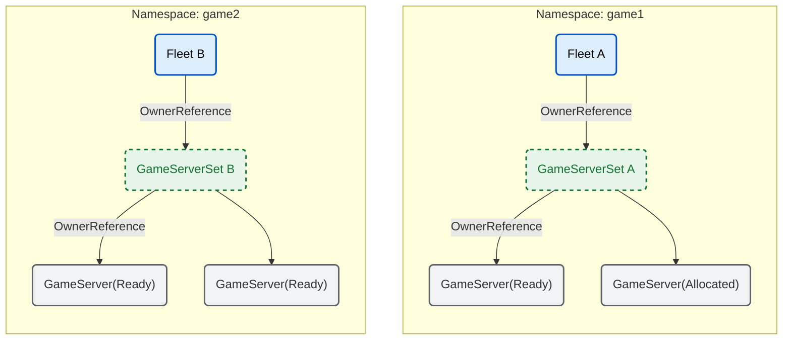

こんにちは、[@sugar235711](https://twitter.com/sugar235711)です。
この記事は「ひとりで気になるOSSのソースコード全部読んで何かする Advent Calendar 2025」3日目の記事です。
https://qiita.com/advent-calendar/2025/sugarcat


- [全体編](https://zenn.dev/king/articles/4e55f030aa01ee)
- [GameServer編](https://zenn.dev/king/articles/003f7b79409b4a)
- [Fleet編](https://zenn.dev/king/articles/e956ef8f3cd6bf) ←今ここ
- GameServerAllocation編
- FleetAutoscaler編
- Metrics編


### Fleetとは
お待ちかねFleetです。
https://agones.dev/site/docs/reference/fleet/

FleetはGameServerの集合体を表すCustom Resourceです。
GameServerを個々に扱うのではなく、事前にウォームアップが完了したGameServerをまとめて扱えるようにしているものです。スケールやアップデート等の管理をFleet単位で行うことができます。

Fleetは内部的にGameServerSetを管理し、GameServerSetが実際のGameServerインスタンスを管理するという階層構造になっています。これによりKubernetesのDeployment/ReplicaSet/Podと同様のローリングアップデートやバージョン管理が可能になっています。

### Fleet Controllerの実装

実際にどのようにGameServerの管理をしているかControllerの実装を見ていきます。
WorkQueueに対して`syncFleet`メソッドが登録されており、以下のような処理フローで動作しています。

1. 該当NameSpace内の全GameServerSetを取得
2. Fleetの管理下にあるGameServerSetをフィルタリング
3. デプロイメントStrategy（RollingUpdate/Recreate）に応じた処理を実行
4. 必要なGameServer数を計算し、実際のレプリカ数と比較
5. 差分に応じてGameServerSetのスケールアップ/ダウンを実行

https://github.com/googleforgames/agones/blob/f88b410c5fa444d29d9f5de77bc53997709fabef/pkg/fleets/controller.go#L293-L318

Strategyには以下の2種類があり、デフォルトはRollingUpdateです。

### OwnerReferenceによる親子関係の管理

Fleetの管理下にあるかどうかの判定には`IsControlledBy`メソッドが使われており、これはKubernetes apimachineryのOwnerReferenceを利用してUID単位で比較を行っています。
https://pkg.go.dev/sigs.k8s.io/cluster-api/util#IsControlledBy

OwnerReferenceは`Fleet → GameServerSet`, `GameServerSet → GameServer`のそれぞれのパッケージ内で`NewControllerRef`メソッドにより参照が設定されています。

https://github.com/googleforgames/agones/blob/f88b410c5fa444d29d9f5de77bc53997709fabef/pkg/apis/agones/v1/fleet.go#L132

OwnerReferenceはKubernetesのオブジェクト間の親子関係を示すための仕組みです。
https://kubernetes.io/ja/docs/concepts/overview/working-with-objects/owners-dependents/

- 従属オブジェクトは親オブジェクトが削除されると自動的にガベージコレクションされる
- 有効なOwnerReferenceは従属オブジェクトと同じNamespace内のオブジェクトの名前とUIDで構成される
- Namespaceをまたぐ参照は仕様により許可されていない

この仕組みにより、Fleetを削除すれば配下のGameServerSetとGameServerも連鎖的に削除され、リソースのライフサイクル管理が自動化されています。




と、ここまでみると`Fleet→GameServerSet→GameServer`の関係性は`Deployment→ReplicaSet→Pod`の関係性と非常に似ており、Fleetは複数世代のgameServerSetを管理することでローリングアップデートを実現できるようになっていることに気づきます。

一般的なDeploymentと比べてGameServerのStatus管理に合わせてAllocatedのReplica数を取得し、RollingUpdateとGarbage Collectionの処理を行ってたりしている点が異なります。

https://github.com/googleforgames/agones/blob/3b94c58f3819456ba259195e9785d87cf3392d9b/pkg/fleets/controller.go#L464

これらの処理により、プレイ中のゲームセッションを中断することなく、安全にGameServerの更新が可能になっています。

https://agones.dev/site/docs/guides/fleet-updates/

GameServerの詳細
https://zenn.dev/king/articles/003f7b79409b4a

### AllocationOverflow機能
最後に`AllocationOverflow`について触れます。

Fleet/GameServerSet には `allocationOverflow`という機能があります。

```yaml
  # Labels and/or Annotations to apply to overflowing GameServers when the number of Allocated GameServers is more
  # than the desired replicas on the underlying `GameServerSet`
  allocationOverflow:
    labels:
      mykey: myvalue
      version: "" # empty an existing label value
    annotations:
      otherkey: setthisvalue
```

ローリングアップデート中やスケールダウン時、 旧バージョンのGameServerがAllocated状態（ゲームプレイ中）で残り、Fleetの`Spec.Replicas`を超えるGameServerが存在する状態になることがあります。
`Status.AllocatedReplicas > Spec.Replicas`となった場合、`AllocationOverflowController`が動作し、定義したラベルやアノテーションを溢れたGameServerに追加することで、GameServer外のリソースと連携できるようになっています。

例えば、Cluster Autoscalerと連携している場合、以下のように`cluster-autoscaler.kubernetes.io/safe-to-evict: "true"`ラベルを追加することで、Allocated状態のGameServerが存在するノードをスケールダウン対象から除外できます。

```yaml
allocationOverflow:
  labels:
    cluster-autoscaler.kubernetes.io/safe-to-evict: "true"
```

なお、GameServerの中断制御に関しては`eviction`の設定でも調整が可能です：
https://agones.dev/site/docs/advanced/controlling-disruption/

### まとめ
Fleetを見ていきました。GameServerの集合としてOwnerReferenceを利用して管理されており、GameServerを効率よく管理するには必要な機能が揃っていることがわかりました。
明日は`GameServerAllocation`を見ていきます。