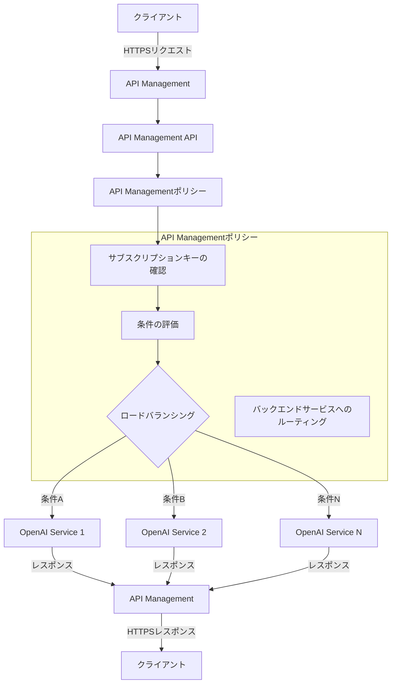

こんにちは、[sugar-cat](https://twitter.com/sugar235711)です。

昨今LLMの活用が当たり前となりましたが、本格的に活用するためには**各プロバイダーのモデルごとの標準化**、**レート制限への対応**、**可用性の向上**など、様々な要素を考慮する必要があります。

この記事では、Terraformを使用してAzure OpenAIとAzure API Managementの組み合わせにより、**Azure環境内で比較的安価にロードバランシングを実現する方法の一例**を紹介します。※各サービスの詳細な説明は省略します。
なお、API ManagementはBasicまたはStandardプランを想定しており、VNet統合が必要なPrivate Endpoint等は使用していません。

## API ManagementとAzure OpenAI

既出の情報ですが、Azure OpenAIを利用する際にAPI Managementを利用することで簡単にロードバランシングを実現できます。

https://techcommunity.microsoft.com/t5/fasttrack-for-azure/smart-load-balancing-for-openai-endpoints-and-azure-api/ba-p/3991616

API Managementをリバースプロキシとして利用し、バックエンドに複数のOpenAIインスタンスを登録することでリクエストを分散させることが可能です。
リクエスト分散の設定は**XMLで定義されたポリシーを用いて実現**できます。



API Managementのようなマネージドゲートウェイを介することで、クライアントはバックエンドサービスの詳細を知ることなく、API Managementのエンドポイントにリクエストを送信できます。
またポリシーにより**負荷分散オプション（ラウンドロビン、重み付け、優先度ベース）**を設定したり、**サーキットブレーカー機能**を持たせることも可能です。
https://learn.microsoft.com/ja-jp/azure/api-management/backends

## Terraformによる実装

次にTerraformを使用してAPI Managementを構築する際に必要な主要リソースについて説明します。

1. `API Managementのリソース`
2. `Azure OpenAIのバックエンドサービスへの登録`
3. `API Managementのポリシー`
4. `Azure OpenAIをAPIキーなしで利用するためのManaged ID`

:::details Terraform全体
```tf
/**
 * API Management用リソースグループ
 */

resource "azurerm_resource_group" "aoai_lb_rg" {
  name     = "${var.env}-apim-aolb-rg"
  location = var.location
}

/**
 * API Management本体
 */
resource "azurerm_api_management" "aoai_lb_apim" {
  name                = "${var.env}-apim-aolb"
  location            = var.location
  resource_group_name = azurerm_resource_group.aoai_lb_rg.name
  publisher_name      = "xxx"
  publisher_email     = "xxx"
  sku_name = "Basic_1"

  identity {
    type = "UserAssigned"
    identity_ids = [
      azurerm_user_assigned_identity.aoai_lb_identity.id
    ]
  }
}

/**
 * API Managementからバックエンドサービスへのアクセス権限
 */
resource "azurerm_user_assigned_identity" "aoai_lb_identity" {
  name                = "${var.env}-apim-aolb-identity"
  location            = azurerm_resource_group.aoai_lb_rg.location
  resource_group_name = azurerm_resource_group.aoai_lb_rg.name
}

resource "azurerm_role_assignment" "aoai_lb_role_assignment" {
  for_each             = var.openai_accounts
  scope                = each.value.id
  role_definition_name = "Cognitive Services OpenAI User"
  principal_id         = azurerm_user_assigned_identity.aoai_lb_identity.principal_id
}


/**
 * API Management APIとして使用できるAPIの定義
 */
resource "azurerm_api_management_api" "aoai_lb_apim_api" {
  name                = "${var.env}-openai-api"
  resource_group_name = azurerm_resource_group.aoai_lb_rg.name
  api_management_name = azurerm_api_management.aoai_lb_apim.name
  revision            = "1"
  display_name        = "${var.env}-openai-api"
  path                = "openai"
  protocols           = ["https"]

  subscription_required = true
  subscription_key_parameter_names {
    header = "api-key"
    query  = "api-key"
  }

  import {
    content_format = "openapi+json"
    content_value  = file("${path.module}/openapi/openai.json")
  }
}

/**
 * API Management APIのバックエンドサービスとして使用するOpenAIのエンドポイント
 */
resource "azurerm_api_management_backend" "aoai_lb_apim_backend" {
  for_each = var.openai_accounts

  name                = "${var.env}-openai-backend-${each.key}"
  resource_group_name = azurerm_api_management.aoai_lb_apim.resource_group_name
  api_management_name = azurerm_api_management.aoai_lb_apim.name
  description         = "${var.env}-openai-backend"
  url                 = each.value.endpoint
  protocol            = "http"
}

/**
 * OpenAIの負荷分散を行うためのポリシーの設定
 */
resource "azurerm_api_management_api_policy" "aoai_lb_apim_api_policy" {
  resource_group_name = azurerm_api_management.aoai_lb_apim.resource_group_name
  api_management_name = azurerm_api_management.aoai_lb_apim.name
  api_name            = azurerm_api_management_api.aoai_lb_apim_api.name
  xml_content         = templatefile("${path.module}/policy/openai.tftpl", {
    uris = { for key, value in var.openai_accounts : key => value.endpoint },
    client_id = azurerm_user_assigned_identity.aoai_lb_identity.client_id
  })
}
```
:::

### 1. API Managementのリソース

API Managementにはv1/v2のプランがあり、それぞれでSLAやオートスケールの上限が異なります。
https://azure.microsoft.com/ja-jp/pricing/details/api-management/
※この記事では紹介しませんが、よりセキュアに利用するにはAzure OpenAIをパブリックに公開せず、VNet統合を行うことが推奨されています。

```tf
resource "azurerm_api_management" "aoai_lb_apim" {
  name                = "${var.env}-apim-aolb"
  location            = var.location
  resource_group_name = azurerm_resource_group.aoai_lb_rg.name
  publisher_name      = "Hoge"
  publisher_email     = "hoge@example.com"
  sku_name = "Basic_1"
}
```

Azure OpenAIでは、各バージョンごとのOpenAPIが公開されています。
https://github.com/Azure/azure-rest-api-specs/tree/main/specification/cognitiveservices/data-plane/AzureOpenAI/inference/stable

これを利用して、API ManagementにAPIを登録します。importブロックを使用して、OpenAPIを読み込みます。

```tf
resource "azurerm_api_management_api" "aoai_lb_apim_api" {
  # ...

  import {
    content_format = "openapi+json"
    content_value  = file("${path.module}/openapi/openai.json")
  }
}
```

OpenAPIの中身は基本的に変更することはありませんが、`servers`のデフォルト値をそれぞれの環境に合わせて調整しておきましょう。

```json
"servers": [
    {
        "url": "https://{endpoint}/openai",
        "variables": {
            "endpoint": {
                "default": "https://example.xxx.openai.azure.com" <-ここ
            }
        }
    }
]
```

これを読み込むとAPI ManagementにAPIが登録されます。


### 2. Azure OpenAIのバックエンドサービスへの登録

API Managementを作成したら、実際にロードバランシングしたいバックエンドサービスを登録します。
`azurerm_cognitive_account`から`openai`のエンドポイントを取得し、それをAPI Managementのバックエンドサービスとして登録します。

```tf
variable "cognitive_accounts" {
  description = "バックエンド用のOpenAIアカウントのマップ"
  type = map(object({
    endpoint = string
    id       = string
  }))
}

resource "azurerm_api_management_backend" "aoai_lb_apim_backend" {
  for_each = var.cognitive_accounts

  name                = "${var.env}-openai-backend-${each.key}"
  resource_group_name = azurerm_api_management.aoai_lb_apim.resource_group_name
  api_management_name = azurerm_api_management.aoai_lb_apim.name
  description         = "${var.env}-openai-backend"
  url                 = each.value.endpoint
  protocol            = "http"
}
```

バックエンドに登録すると、APIs > Backendsに表示されます。


### 3. API Managementのポリシー

ポリシーは定義済みのバックエンドをもとにリクエストを分散させたり、Managed Identityを利用して認証を行うための設定を行うことができます。
XMLで記述するため、Terraformの`templatefile`を利用して動的に値を埋め込みます。

```tf
resource "azurerm_api_management_api_policy" "aoai_lb_apim_api_policy" {
  resource_group_name = azurerm_api_management.aoai_lb_apim.resource_group_name
  api_management_name = azurerm_api_management.aoai_lb_apim.name
  api_name            = azurerm_api_management_api.aoai_lb_apim_api.name
  xml_content         = templatefile("${path.module}/policy/openai.tftpl", {
    uris = { for key, value in var.cognitive_accounts : key => value.endpoint },
    client_id = azurerm_user_assigned_identity.aoai_lb_identity.client_id
  })
}
```

XMLをテンプレートとして記述し動的にバックエンドを埋め込めるようにします。

```xml:openai.tftpl
<policies>
    <inbound>
        <base />
    </inbound>
    <backend>
        <choose>
            <!-- 定義済みのバックエンドからランダムに選ぶ -->
            <when condition="@(true)">
                <set-variable name="backendUrl" value="@{
                    var backends = new System.Collections.Generic.List<string>(){
                        %{ for key, uri in uris }
                        "${uri}",
                        %{ endfor }
                    };
                    return backends[new System.Random().Next(0, backends.Count)];
                }" />
                <set-backend-service base-url="@((string)context.Variables["backendUrl"])" />
            </when>
        </choose>
    </backend>
    <outbound>
        <base />
    </outbound>
    <on-error>
        <base />
    </on-error>
</policies>
```

上記のようにテンプレートとして記述しておくことで、将来Cognitive Accountが追加されたり変更された際もポリシー自体の修正は必要ありません。

### 4. Azure OpenAIをAPIキーなしで利用するためのManaged ID

パブリックに公開されているAzure OpenAIには、APIキーまたはManaged IDによる接続が可能です。
今回はAPIキーの管理を行いたくないため、Managed IDによる認証方法を紹介します。

必要なUser Assigned Identityを作成し、`Cognitive Services OpenAI User`を割り当てます。

```tf
resource "azurerm_user_assigned_identity" "aoai_lb_identity" {
  name                = "${var.env}-apim-aolb-identity"
  location            = azurerm_resource_group.aoai_lb_rg.location
  resource_group_name = azurerm_resource_group.aoai_lb_rg.name
}

resource "azurerm_role_assignment" "aoai_lb_role_assignment" {
  for_each             = var.openai_accounts
  scope                = each.value.id
  role_definition_name = "Cognitive Services OpenAI User"
  principal_id         = azurerm_user_assigned_identity.aoai_lb_identity.principal_id
}
```

その後1で定義した`azurerm_api_management`リソースの`identity`ブロックにUser Assigned Identityを割り当てます。

```tf
resource "azurerm_api_management" "aoai_lb_apim" {
  # ...
  identity {
    type = "UserAssigned"
    identity_ids = [
      azurerm_user_assigned_identity.aoai_lb_identity.id
    ]
  }
}
```

最後に3で定義したポリシー内で、AuthorizationヘッダーをManaged IDから取得したトークンで上書きするように設定します。

```xml
<policies>
    <inbound>
        <!-- Managed IDの設定 -->
        <authentication-managed-identity
            resource="https://example.com"
            output-token-variable-name="msi-access-token"
            client-id="${client_id}"
            ignore-error="false" />
        <set-header name="Authorization" exists-action="override">
            <value>@("Bearer " + (string)context.Variables["msi-access-token"])</value>
        </set-header>
    </inbound>
    <!-- ... -->
</policies>
```

以上の設定を行うことでクライアントからAPI Managementに送信されたリクエストが、API Managementのポリシーに従ってバックエンドサービスを選択し、Managed IDによる認証を経てAzure OpenAIにリクエストを送信できるようになります。

### 動作確認

ベースとなるエンドポイントを変更するだけでOpenAIのSDKをそのまま使用し、リクエストを行うことが可能です。その際、API Management側で適宜スコープを絞ったサブスクリプションキーが必要になるため、必要に応じて発行し、`api-key`をリクエストヘッダーに付与してリクエストを行います。

```python
import os
from dotenv import load_dotenv
from openai import AzureOpenAI

load_dotenv()

api_key = os.getenv("AZURE_OPENAI_API_KEY")
apim_url = os.getenv("AZURE_OPENAI_APIM_URL")
client = AzureOpenAI(
    azure_endpoint=apim_url,
    api_key=api_key,
    api_version="2023-06-01-preview"
)

response = client.chat.completions.create(
    model="gpt-35-turbo",
    messages=[
        {"role": "system", "content": "You are a helpful assistant."},
        {"role": "user", "content": "Does Azure OpenAI support customer managed keys?"}
    ]
)
print(response)
```

また、API Managementはデフォルトで`Ocp-Apim-Subscription-Key`をサブスクリプションキーとして認識するため、あらかじめ上書きを行う必要があります。

```tf
resource "azurerm_api_management_api" "aoai_lb_apim_api" {
    # ...

  subscription_required = true
  subscription_key_parameter_names {
    header = "api-key"
    query  = "api-key"
  }
}
```

https://learn.microsoft.com/ja-jp/azure/api-management/api-management-subscriptions#create-and-manage-subscriptions-in-azure-portal

残念ながらこのサブスクリプションキーには自動ローテーションの仕組みが用意されていないため、自前でAPIを叩くなどして実装する必要があります。
https://learn.microsoft.com/en-us/rest/api/apimanagement/subscription/regenerate-primary-key?view=rest-apimanagement-2023-09-01-preview&tabs=HTTP

## まとめ

API Managementを利用することで、Azure OpenAIのロードバランシングを簡単に実現することができます。
他プロバイダーへの依存がなく、社内の検証用環境であればBasicやStandardプランでも十分な性能を発揮するため、安価に運用できます。
Azure OpenAIを利用する際にはぜひ検討してみてください。
